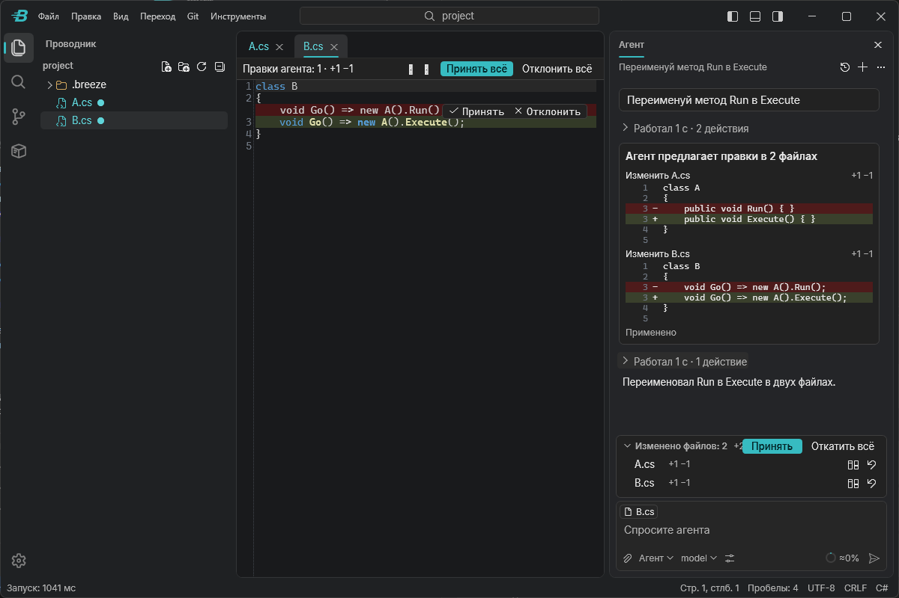
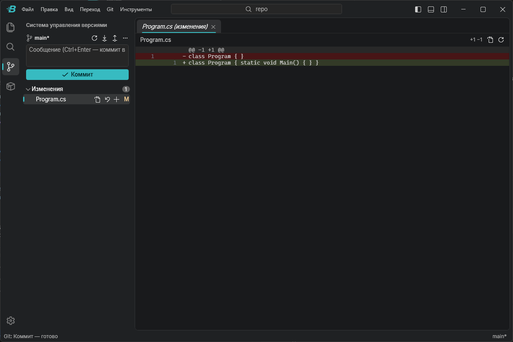
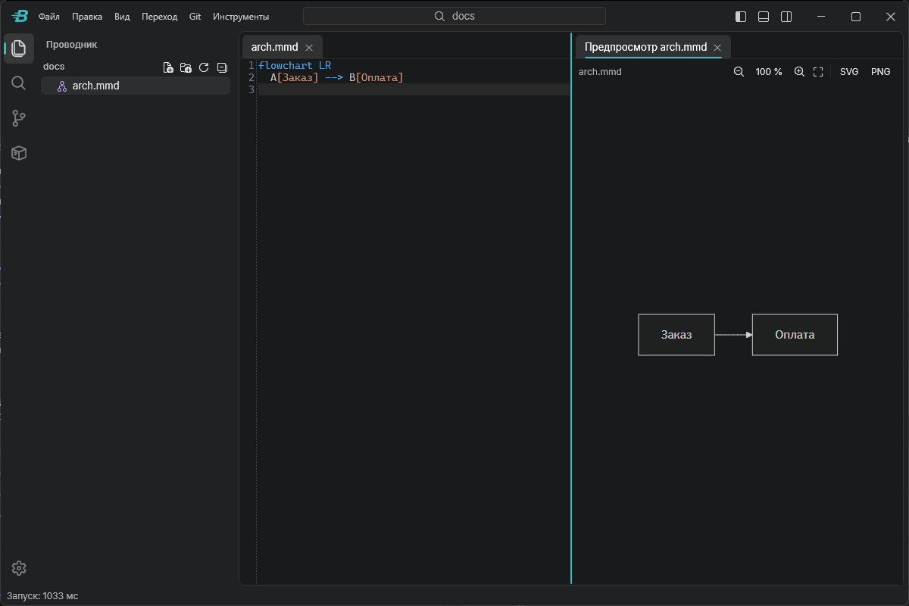

<p align="center">
  
</p>

<h1 align="center">Breeze</h1>

<p align="center">
  Лёгкий редактор кода на WPF, вдохновлённый VS Code.<br>
  Его ИИ-агент берёт лучшее из популярных агентов, но работает без подписки.
</p>

<p align="center">
  <a href="../../releases/latest"><b>Скачать</b></a> ·
  <a href="#установка">Установка</a> ·
  <a href="#для-разработчиков">Для разработчиков</a> ·
  <a href="CHANGELOG.md">Что нового</a>
</p>

> [!NOTE]
> Breeze — предварительная версия (alpha). Основные функции работают, но возможны ошибки, а настройки и формат данных
> ещё могут меняться. О проблемах пишите в [задачи](../../issues).



## Зачем ещё один редактор

**Как VS Code, только легче.** Палитра команд, быстрое открытие файлов, настройки в `settings.json` и привычные
сочетания клавиш. Но Breeze — обычное приложение Windows на .NET и WPF, а не браузерный движок, как VS Code, поэтому
окно обычно открывается меньше чем за секунду.

**Лучшее из популярных агентов.** Агент Breeze собран по образцу Cursor, GitHub Copilot и Claude Code:

- правки сразу попадают в файлы и подсвечиваются в редакторе, пока вы их не проверите, — как в Cursor;
- режимы «Агент», «Вопрос» и «План» и отдельная настройка под каждое семейство моделей — как в Copilot;
- правила проекта в `AGENTS.md` и `CLAUDE.md` и память между чатами — как в Claude Code.

**Без подписки.** Breeze бесплатен. За работу моделей вы платите сервису по факту — только за потраченные токены,
без ежемесячной платы.

### Почему AITUNNEL

Агенту нужен сервис, через который он обращается к моделям. Сейчас это [AITUNNEL](https://aitunnel.ru/?r=58933):

- **оплата в рублях** российской картой и доступ без VPN — подписки Cursor, Copilot и Claude Code из России оплатить
  сложно;
- **один ключ** — модели OpenAI, Anthropic, xAI и DeepSeek;
- **оплата по факту** с баланса, без подписки;
- **агент проверен на нём:** повторяющаяся часть запроса берётся из кэша и стоит дешевле, а рассуждения модели
  сохраняются между шагами.

Позже Breeze научится работать и с другими API. Опытные пользователи уже сейчас могут указать свой
OpenAI-совместимый сервис в настройке `agent.endpoint`, но список моделей и поиск в интернете пока рассчитаны на
AITUNNEL.

## Возможности

**Редактор.** Подсветка синтаксиса около 60 языков, вкладки и до четырёх групп вкладок, поиск и замена в файле,
автосохранение (настройка `files.autoSave`). Панели перетаскиваются в любую область окна. При запуске открываются
прежняя папка и вкладки.

**Клавиатура и мышь.** Палитра команд (`Ctrl+Shift+P`), быстрое открытие файла (`Ctrl+P`), переход к строке
(`Ctrl+G`), поиск по папке с результатами по мере нахождения (`Ctrl+Shift+F`). Все команды есть в палитре, основные —
ещё и в меню. Сочетания клавиш меняются в `keybindings.json` (`Ctrl+K Ctrl+S`).

**Несколько окон.** «Файл → Новое окно» (`Ctrl+Shift+N`) и «Открыть папку в новом окне…» — у каждого проекта своё
окно. Папка, уже открытая в другом окне, не открывается второй раз: Breeze переключается на то окно. Вкладки
запоминаются для каждой папки.

**Перетаскивание.** Файлы и папки переносятся в проводнике (с `Ctrl` — копируются), а из Проводника Windows — в
проводник Breeze, в редактор и в чат агента.

**Масштаб.** Интерфейс — `Ctrl+=`, `Ctrl+-`, `Ctrl+0` или `Ctrl`+колесо; шрифт редактора — `Ctrl`+колесо над
редактором.

**ИИ-агент** (`Ctrl+Alt+I`) работает в трёх режимах:

- **Агент** делает задачу сам: читает и правит файлы, ищет по коду, собирает и тестирует проект .NET, запускает
  команды PowerShell.
- **Вопрос** отвечает на вопросы по коду, ничего не меняя.
- **План** изучает код и предлагает план. Выполнить его — кнопкой под планом.

Правки агента сразу сохраняются на диск и подсвечиваются в редакторе, пока вы их не проверите. Каждую правку можно
принять или откатить — и после перезапуска тоже. Команды, которые что-то меняют, удаление файлов,
`git push` и незнакомые сайты агент выполняет только после вашего подтверждения.

Агент работает с Git, Docker, встроенным браузером, интернетом, картинками и документами. Он помнит важное о проекте
между чатами и сжимает длинный разговор, чтобы не упереться в предел модели. К сообщению можно приложить файлы и
картинки. История чатов хранится для каждой папки. Модель и её параметры — глубина рассуждений, предел ответа,
подтверждение правок — выбираются прямо в чате.

**Git.** Панель (`Ctrl+Shift+G`) и меню «Git»: изменения, индекс, коммит, ветки, история, сравнение версий, pull,
push и fetch.

**Docker.** Панель контейнеров, образов и сервисов Compose: запуск, остановка, перезапуск, удаление, журналы,
`compose up` и `down`.

**Не только код:**

- PDF;
- Word и PowerPoint — текст, таблицы и заметки;
- Excel, CSV и TSV — таблицей;
- схемы Mermaid с предпросмотром (`Ctrl+K V`) и выгрузкой в SVG и PNG;
- картинки, SVG, аудио и видео;
- двоичные файлы — в шестнадцатеричном виде.

Встроенный браузер открывается во вкладке рядом с файлами.

**Свои инструменты.** Скрипты из `.breeze/tools` запускаются из меню «Инструменты», из палитры и агентом. Новый или
изменённый инструмент запускается только после вашего подтверждения.

**Настройки** — в `settings.json`, как в VS Code: общие (`Ctrl+,`) и для папки (`.breeze/settings.json`). Есть
светлая и тёмная темы (`Ctrl+K Ctrl+T`), интерфейс на русском и английском.

<table>
  <tr>
    <td></td>
    <td></td>
  </tr>
</table>

## Установка

1. Скачайте `BreezeCodeEditor-win-Setup.exe` со [страницы последнего выпуска](../../releases/latest).
2. Запустите его. Права администратора не нужны: Breeze ставится в папку пользователя
   (`%LocalAppData%\BreezeCodeEditor`) и создаёт ярлыки на рабочем столе и в меню «Пуск».

Установщик добавляет в Проводник Windows пункт «Открыть в Breeze» для файлов и папок и Breeze в список «Открыть с
помощью». В Windows 11 этот пункт находится в меню «Показать дополнительные параметры». Файл из Проводника открывается
в окне, где открыта его папка.

Файлы пока не подписаны сертификатом, поэтому Windows SmartScreen может показать предупреждение. Нажмите
«Подробнее → Выполнить в любом случае». Подлинность файла можно проверить: у каждого выпуска есть аттестация
происхождения от GitHub (`gh attestation verify <файл> --repo <владелец>/<репозиторий>`).

Без установки работает переносная версия: распакуйте `BreezeCodeEditor-win-Portable.zip` и запустите `Breeze.exe`.

**Требования:** Windows 10 или 11, x64. Для браузера, документов и схем нужен
Microsoft Edge WebView2 Runtime: в Windows 11 он уже есть, в Windows 10 обычно ставится вместе с Edge.

**Обновления.** Breeze сам находит новую версию на GitHub, загружает её в фоне и ставит при перезапуске. Проверить
вручную — «Справка → Проверить обновления…». Отключить проверку при запуске — `"update.mode": "manual"` в настройках.

**Удаление** — «Параметры Windows → Приложения → Установленные приложения → Breeze». Настройки, журналы и ключ
остаются в `%LocalAppData%\Breeze`; удалите эту папку, если они больше не нужны.

## Быстрый старт

1. Откройте папку проекта: «Файл → Открыть папку…» (`Ctrl+K Ctrl+O`).
2. Откройте чат агента (`Ctrl+Alt+I`) и напишите задачу.
3. Если ключа ещё нет, чат предложит его задать (кнопка «Задать ключ API» или та же команда в палитре). По
   умолчанию это ключ [AITUNNEL](https://aitunnel.ru/?r=58933): получите его на сайте сервиса и пополните баланс. Ключ хранится
   зашифрованным для вашей учётной записи Windows.

**Правила для агента** Breeze читает из нескольких файлов:

- `.breeze/agent.md` — главный файл правил папки, его можно хранить в репозитории. Открыть или создать — командой
  «Агент: Правила папки (agent.md)»;
- `AGENTS.md` и `CLAUDE.md` в корне проекта;
- `.breeze/rules/*.md` — правила для отдельных файлов;
- `%LocalAppData%Breezeagent.md` — личные правила для всех папок, в репозиторий они не попадают.

Основные настройки:

| Настройка | Что задаёт |
| --- | --- |
| `workbench.colorTheme` | тема: `Dark+` или `Light+` |
| `workbench.language` | язык интерфейса: `auto`, `ru` или `en`; меняется после перезапуска |
| `editor.fontSize`, `editor.tabSize`, `editor.wordWrap` | шрифт, отступы и перенос строк в редакторе |
| `files.autoSave` | автосохранение: `off`, `afterDelay` или `onFocusChange` |
| `agent.model` | модель агента |
| `agent.approvals` | `auto` — правки сразу в файлах, `edits` — каждую правку подтверждать |
| `update.mode` | `default` — проверять обновления при запуске, `manual` — только по команде |
| `log.level` | подробность журнала: от `trace` до `error` |

## Конфиденциальность

Breeze не собирает телеметрию. Сам он обращается в сеть в трёх случаях:

- **Сервис моделей.** Запросы агента уходят на выбранный вами сервис. В них попадают ваши сообщения и то, что агент
  прочитал в проекте. Кроме ходов агента, есть служебные запросы:
  - извлечение памяти после хода (отключается настройкой `agent.autoMemory`);
  - сжатие длинного чата;
  - прогрев кэша Claude после паузы (`agent.cacheWarmup`).
- **Интернет по просьбе агента:** поиск, загрузка страниц и встроенный браузер. Незнакомые сайты агент открывает
  только после вашего подтверждения.
- **Обновления.** Установленная программа проверяет выпуски этого репозитория на GitHub.

Ещё в сеть выходят действия, которые вы запускаете сами: pull и push в Git, загрузка образов Docker, восстановление
пакетов при сборке, ссылки из меню «Справка» и ваши инструменты.

Журналы пишутся только на ваш компьютер, в `%LocalAppData%Breezelogs`. История чатов, память агента и
непроверенные правки лежат в папке проекта, в `.breeze/agent/`; эта папка сама исключена из git.

## Для разработчиков

### Технологии

| Задача | Чем решена |
| --- | --- |
| Платформа | .NET 10, WPF, C# 14 |
| Хостинг, DI, настройки, журнал | Microsoft.Extensions.Hosting, DependencyInjection, Options, Logging |
| MVVM | CommunityToolkit.Mvvm |
| Текстовый редактор | AvalonEdit |
| Markdown в чате | Markdig |
| ИИ-агент | Microsoft Agent Framework (`Microsoft.Agents.AI`, Workflows), Microsoft.Extensions.AI, OpenAI .NET |
| Браузер, схемы, медиа | WebView2, Mermaid |
| Документы | Open XML SDK, PdfPig, PDFsharp и MigraDoc |
| Git и Docker | `git` и `docker` CLI без оболочки |
| Установщик и обновления | Velopack |
| Тесты | xUnit v3 на Microsoft.Testing.Platform, FlaUI (UI-тесты), BenchmarkDotNet |
| CI/CD | GitHub Actions |

### Архитектура

Слои идут в одну сторону: `Core` → `Shell` → `UI` / `Shell.Wpf` → `App`.

- **`CodeEditor.Core`** — ядро без WPF: команды, сочетания клавиш, меню, настройки, файлы, журнал.
- **`CodeEditor.Shell`** — оболочка: ViewModel окна, палитра, панели, вкладки, сессия.
- **`CodeEditor.UI`** — тема, шрифты, иконки и общие элементы управления.
- **`CodeEditor.Shell.Wpf`** — представления оболочки.
- **`Breeze`** (`src/Apps/CodeEditor.App`) — тонкий хост, который собирает модули.

Функции живут в модулях. Модуль `CodeEditor.Modules.X` содержит логику и ViewModel без WPF, `CodeEditor.Modules.X.Wpf` —
представления, `CodeEditor.Modules.X.Contracts` — общие контракты. Модули: Explorer, Search, TextEditor, Agent, Git,
Docker, Terminal, Browser, Diagrams, Documents, Viewers, Tools, Output, Updates.

Модуль регистрирует панели, представления, команды и пункты меню через реестры оболочки, а оболочку ради него не
меняют. Любое действие — команда с id, поэтому меню, сочетания клавиш, палитра и инструменты агента строятся из
одних команд. Правила слоёв проверяют архитектурные тесты.

### Сборка и запуск

Нужны Windows 10/11, [.NET SDK 10](https://dotnet.microsoft.com/download/dotnet/10.0) и Visual Studio 2026 или
Rider. Откройте решение `CodeEditor.slnx` и запустите проект `CodeEditor.App`.

Из командной строки:

```bash
dotnet build CodeEditor.slnx
```

```bash
dotnet run --project src/Apps/CodeEditor.App
```

Сборка проходит без предупреждений: они считаются ошибками.

### Тесты

Модульные и архитектурные тесты:

```bash
pwsh ./build/test.ps1
```

UI-тесты запускают настоящее окно и двигают мышь, поэтому во время них не трогайте мышь и клавиатуру:

```bash
pwsh ./build/test.ps1 -Ui
```

Бенчмарки горячих путей:

```bash
dotnet run -c Release --project tests/CodeEditor.Benchmarks -- --filter *
```

Бенчмарк агента на реальных моделях описан в [tests/CodeEditor.Agent.Eval](tests/CodeEditor.Agent.Eval/README.md).
Он тратит токены.

### Установщик локально

```bash
pwsh ./build/publish.ps1 -Version 0.1.0-dev -Pack
```

Скрипт публикует самодостаточную сборку в `publish/`, а Velopack собирает `Setup.exe`, переносной zip и пакет
обновления в `releases/`.

### Структура репозитория

| Папка | Что там |
| --- | --- |
| `src/Platform` | ядро, оболочка, тема и элементы управления |
| `src/Modules` | модули с функциями |
| `src/Apps/CodeEditor.App` | хост приложения, `Breeze.exe` |
| `tests` | модульные, архитектурные и UI-тесты, бенчмарки, бенчмарк агента |
| `build` | скрипты тестов, публикации и заметок о выпуске |
| `assets` | знак, иконка и скриншоты |
| `.github` | CI, выпуск, шаблоны задач |

Как предложить изменение, как устроены ветки, версии и выпуски — в [CONTRIBUTING.md](CONTRIBUTING.md).

## Лицензия

[MIT](LICENSE). Сторонние компоненты и их лицензии перечислены в [THIRD-PARTY-NOTICES.md](THIRD-PARTY-NOTICES.md).
